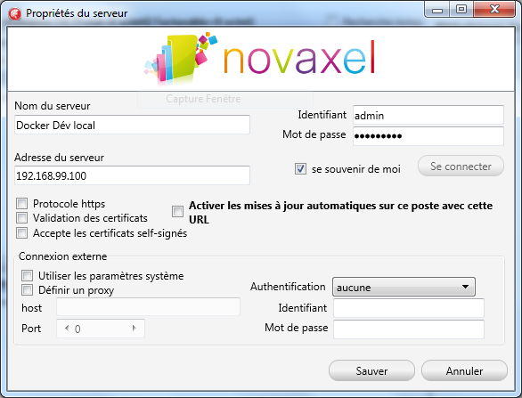

Images Docker pour Serveur d'application Firebird
=======
Ce projet contient 2 images :


## Une image de base : _novaxel/firebird_

* source ubuntu:14:04
* serveur Firebird 64 bits (installation package distribution upstream)
* outils Novaxel clients 32 bits (/opt/novaxel/novatools)
* moteur de script Novaxel (nscript)
* utilitaire de cryptographie Novaxel (crypto)
* les dépendances (lib 32 bits)
* outils pour synchronisation :
  * stunnel
  * rsync
* fichiers de configuration adaptés pour Firebird, rsync, stunnel
* certificat SSL autosigné (localhost)
* scripts Novaxel dédiés au contexte (synchronisation)
* udf Firebird nécessaire à la recherche fulltext


## Une image spécifique au serveur d'application : _novaxel/nas-server_

* source novaxel/firebird (ie. mêmes éléments que ci-dessus)
* le serveur d'application (/opt/novaxel/novaappserver) + dépendances libs 64 bits
* le client WEB actuel

C'est cette dernière image qui sera installée sur un poste de Développement...


## installation poste de Développement

* Prérequis :
  * récuper le dépôt git (ceci doit-être fait si ce document est en cours de lecture ;-) )
  * installation de [_docker toolbox_](https://www.docker.com/toolbox)
  * lancement de "Docker QuickStart terminal" sur le bureau (ou équivalent menu `Démmarer/Docker`)
  * au premier lancement, ceci va créer et lancer une VM VirtualBox "Default" (ça peut-être long...)
  * Pour vérifier l'adresse IP du réseau privé Virtualbox affectée à la VM : `docker env --shell cmd default` : ce devrait être 192.168.99.100 par défaut)
  * C'est sur cette VM que fonctionnera le serveur Docker (donc sur cette adresse que l'on trouvera les ports à utiliser pour accéder aux différents services des containers)
* Création de l'image :
  * à partir de la console "Docker QuickStart terminal"
  * lancer la commande : ```./build.sh novaxel/nas_firebird && ./build.sh novaxel/nas-server```
  * Ceci va télécharger tous les éléments nécessaires et construire les images docker (ça peut-être long...)
* Utilisation de l'image (ie. lancement du container)
  * Configuration standard : lancer ```./start-nas-dev.sh```


## Accès aux ressources et paramètres (configuration standard)

* Configuration :
  * ```/opt/novaxel/conf/``` : tous les fichiers de conf sauf :
  * ```/etc/firebird/2.5/``` : la configuration spécifique Firebird
* Bases de données :
  * ```/srv/databases/domain``` : bases domain + event
  * ```/srv/databases/demo``` : bases de démo livrée initialement
  * ```/srv/databases/XXXXXX/YYYYYY``` : bases GED (XXXXXX = tenantID, YYYYYY = DBID)
* logs :
  * ```/var/log/novaxel``` : journalisation du serveur d'application + outils
  * ```/var/log/firebird``` : journalisation Firebird
* Ports :
  * IP_VM_VB:3050 : Firebird (auth : sysdba/masterkey)
  * IP_VM_VB:80/443 : Serveur d'application Novaxel (auth : admin/AdminPass et DEMO/DEMO) + Client WEB (auth DEMO/DEMO)
    * Attention, le certificat fourni en exemple est self signed
  * IP_VM_VB:60443 : Port de synchronisation (même certificat SSL)


## Paramétrages

* Admin :
  * Compte serveur :
  
  * Serveur Firebird :
  
  * DB Démo (penser à au Mode "Dépose de documents" pour synchroniser) :
  
* Novaxel Client lourd (synchronisation DB) :
  
  
